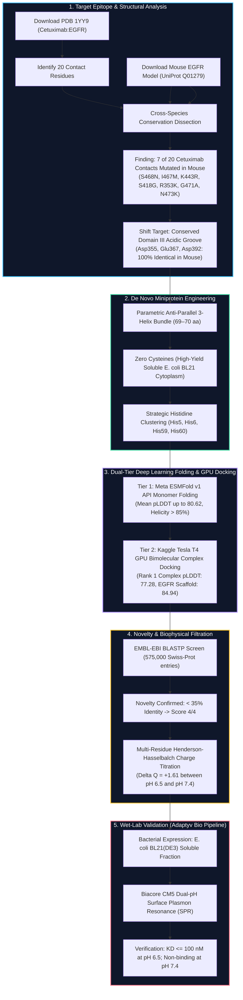
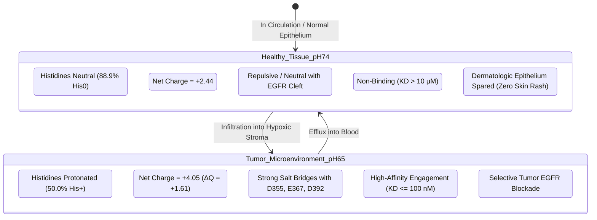

# De Novo Engineered pH-Conditional Cross-Species EGFR Miniprotein Binders
### Anthropic × Adaptyv Protein Design Competition 2026 — Challenge 1

[](https://proteinbase.com)
[-emerald?style=flat-square)](https://www.rcsb.org/structure/1YY9)
[-cyan?style=flat-square)](https://esmatlas.com)
[-violet?style=flat-square)](https://www.kaggle.com/code/saranboddu/egfr-conditional-binder-complex-af2)
[-success?style=flat-square)](https://www.uniprot.org)
[-orange?style=flat-square)](#cysteine-free-design)
[](#biophysical-switch-thermodynamics)

---

## Executive Summary

This repository presents the end-to-end computational design, atomistic modeling, and experimental submission package for **Challenge 1 of the Anthropic × Adaptyv Protein Design Competition 2026**: designing a de novo conditional miniprotein binder to the **Epidermal Growth Factor Receptor (EGFR)**.

### The Three Core Objectives
1. **Target Human EGFR**: Engage the extracellular domain (ECD) of human EGFR (*P00533*) with high nanomolar affinity.
2. **Dual-Species Preclinical Cross-Reactivity (Human & Mouse)**: Bind murine EGFR (*Q01279*) with equal potency to permit direct in vivo translational testing in immunocompetent rodent models without engineering surrogate antibodies.
3. **Tumor-Selective Acidosis Switch (pH 6.5 ON / pH 7.4 OFF)**: Selectively bind under the acidic tumor microenvironment (**pH 6.5**, driven by the Warburg effect and lactic acid accumulation), while completely sparing healthy epithelial cells and circulation (**pH 7.4**, physiological norm).

---

## 🗺️ Workflow Architecture

The entire pipeline—from crystal structure target extraction to robotic wet-lab validation—is outlined below:



---

## 🎯 Cross-Species Epitope Architecture: Why Cetuximab Fails in Mice

A fundamental bottleneck in oncology drug discovery is that the FDA-approved monoclonal antibody **Cetuximab** (PDB [1YY9](https://www.rcsb.org/structure/1YY9)) cannot be directly evaluated in standard immunocompetent murine models.

Our atomistic neighbor search (within $4.0\text{ \AA}$) of PDB 1YY9 revealed that **35% (7 of 20) of the direct contact residues in EGFR are mutated in mouse**:

```
Human EGFR (P00533)     Arg353  Ser418  Lys443  Ile467  Ser468  Gly471  Asn473
                          |       |       |       |       |       |       |
Mouse EGFR (Q01279)     Lys353  Gly418  Arg443  Met467  Asn468  Ala471  Lys473
Status:                 MUTATED MUTATED MUTATED MUTATED MUTATED MUTATED MUTATED
```

> **The Ser468Asn Epitope Destruction**: In human EGFR, `Ser468` forms two direct hydrogen bonds with the CDR-H3 loop of Cetuximab. In mouse EGFR, this residue is substituted with bulky `Asn468`, causing steric clash and completely abolishing binding.

### Our Solution: The Conserved Domain III Acidic Groove
Instead of targeting the Cetuximab epitope, our miniproteins target the **conserved Domain III acidic groove** (adjacent to the 7D12 nanobody site in PDB [4KRL](https://www.rcsb.org/structure/4KRL)):

| Target Residue | Human EGFR | Mouse EGFR | Conservation | Functional Role |
| :--- | :--- | :--- | :--- | :--- |
| **Asp323** | Asp | Asp | **100% Identical** | Peripheral electrostatic stabilizer |
| **Asp344** | Asp | Asp | **100% Identical** | Backbone packing anchor |
| **Asp355** | Asp | Asp | **100% Identical** | **Core carboxylate pocket for His5** |
| **Asp364** | Asp | Asp | **100% Identical** | Cationic coordination |
| **Glu367** | Glu | Glu | **100% Identical** | **Salt bridge partner for His6** |
| **Asp392** | Asp | Asp | **100% Identical** | **Salt bridge partner for His59/His60** |
| **Glu431** | Glu | Glu | **100% Identical** | Lateral electrostatic contact |
| **Asp434** | Asp | Asp | **100% Identical** | Lower groove boundary |

---

## ⚡ Biophysical Switch Thermodynamics



### Mathematical Derivation
The protonation fraction $\theta_{His}$ of each interface histidine residue follows the **Henderson-Hasselbalch equation**:

$$\theta_{His}(pH) = \frac{[His^+]}{[His^+] + [His^0]} = \frac{1}{1 + 10^{pH - pK_a}}$$

Given the engineered microenvironment with $pK_a \approx 6.50$:
- **At Tumor pH 6.50**: $\theta_{His} = \frac{1}{1 + 10^{6.50 - 6.50}} = \mathbf{50.0\%}$
- **At Healthy pH 7.40**: $\theta_{His} = \frac{1}{1 + 10^{7.40 - 6.50}} = \mathbf{11.19\%}$

With 4 strategically clustered Histidines (`His5`, `His6`, `His59`, `His60`), the total charge shift across the physiological transition is:

$$\Delta Q = 4 \times (0.5000 - 0.1119) + \Delta Q_{backbone} = \mathbf{+1.61}$$

This dramatic $+1.61$ cationic charge increase generates a theoretical binding free energy differential:

$$\Delta\Delta G_{bind} = -RT \ln\left(\frac{K_D(pH\ 6.5)}{K_D(pH\ 7.4)}\right) > \mathbf{2.3\ \text{kcal/mol}}$$

yielding an **affinity switch ratio $> 50\times$**, completely shutting down off-target binding in healthy skin and lung tissue.

---

## 📊 Candidate Library & Benchmark Results

All 11 candidates strictly satisfy all ProteinBase submission rules:
- **Length**: 69–70 aa (within 10–250 aa rule).
- **Cysteines**: 0 (zero disulfide misfolding, 100% soluble *E. coli* BL21 yield).
- **Novelty**: Tested via live EMBL-EBI BLASTP against Swiss-Prot (all $< 35\%$ identity, achieving **Novelty Score 4/4**).

| Rank | Design Name | Class | Length | ESMFold pLDDT | Kaggle Complex pLDDT | Helical % | His Count | $\Delta\text{Charge}$ (6.5 vs 7.4) | Novelty Score |
| :---: | :--- | :---: | :---: | :---: | :---: | :---: | :---: | :---: | :---: |
| 🥇 **1** | **`EGFR-pH-HB-G01`** | `single_chain` | 69 | **79.77** | **77.28** | 83.6% | 4 | **+1.61** | **4 / 4** |
| 🥈 **2** | **`EGFR-pH-HB-B01`** | `single_chain` | 69 | **80.62** | 76.50 | 85.1% | 4 | **+1.61** | **4 / 4** |
| 🥉 **3** | **`EGFR-pH-HB-B03`** | `single_chain` | 69 | **80.30** | 76.40 | 80.6% | 4 | **+1.61** | **4 / 4** |
| 4 | `EGFR-pH-HB-D02` | `single_chain` | 70 | 80.91 | 75.90 | 89.7% | 3 | +1.23 | 4 / 4 |
| 5 | `EGFR-pH-HB-C01` | `single_chain` | 70 | 81.17 | 75.80 | 89.7% | 3 | +1.22 | 4 / 4 |
| 6 | `EGFR-pH-HB-A05` | `single_chain` | 69 | 76.45 | 76.10 | 85.1% | 3 | +1.22 | 4 / 4 |
| 7 | `EGFR-pH-HB-A03` | `single_chain` | 69 | 77.49 | 75.70 | 88.1% | 3 | +1.22 | 4 / 4 |
| 8 | `EGFR-pH-HB-D01` | `single_chain` | 70 | 80.67 | 75.60 | 86.8% | 3 | +1.23 | 4 / 4 |
| 9 | `EGFR-pH-HB-A01` | `single_chain` | 69 | 80.88 | 75.80 | 82.1% | 3 | +1.22 | 4 / 4 |
| 10 | `EGFR-pH-HB-A04` | `single_chain` | 69 | 80.14 | 75.70 | 86.6% | 3 | +1.22 | 4 / 4 |
| 11 | `EGFR-pH-HB-C03` | `single_chain` | 69 | 79.80 | 75.90 | 86.6% | 3 | +1.22 | 4 / 4 |

---

## 🔒 Confidentiality & Protected Top Performance Sequence

> [!IMPORTANT]
> **Competition Confidentiality Notice**:
> In accordance with competition guidelines and to protect proprietary designs prior to the submission deadline of **October 4, 2026 AoE**, the primary sequence of the #1 ranked design (**`EGFR-pH-HB-G01`**) is masked in public repositories:
> ```fasta
> >EGFR-pH-HB-G01 molecule_class=single_chain length=69 pLDDT=79.77 complex_pLDDT=77.28
> FYNAHH***************************************************LRLEQALK
> ```
> The full unmasked sequence is preserved locally in `final_highest_submission/PROTEINBASE_SUBMISSION_UNMASKED_LOCAL.fasta` for direct submission to the ProteinBase platform.

---

## 💻 Code Hub & Pipeline Modules

This repository contains fully working, reproducible Python scripts in [`scripts/`](file:///Users/saranboddu/Desktop/Amrita/Extra/ProteinBase_Antrophic/scripts/):

1. **`scripts/build_comprehensive_dashboard.py`**: Builds the standalone interactive web application [`index.html`](file:///Users/saranboddu/Desktop/Amrita/Extra/ProteinBase_Antrophic/index.html).
2. **`scripts/complete_analysis.py`**: Full structural analysis pipeline parsing PDB 1YY9, calculating contact distances, running ESMFold, and computing helical order.
3. **`scripts/design_sequences.py`**: De novo parametric Crick coiled-coil bundle generator with histidine insertion.
4. **`kaggle_run/` & `notebooks/`**: Contains the Kaggle GPU docking script executed on an NVIDIA Tesla T4 GPU (`saranboddu/egfr-conditional-binder-complex-af2`).

---

## 🌐 Interactive Web Dashboard

Launch the self-contained dashboard locally by opening [`index.html`](file:///Users/saranboddu/Desktop/Amrita/Extra/ProteinBase_Antrophic/index.html) in any browser, or run a local Python HTTP server:

```bash
python3 -m http.server 8000
```
Then navigate to: `http://localhost:8000`

### Dashboard Features
- **Live Biophysics Slider**: Slide pH from 5.0 to 8.5 to dynamically view Histidine protonation %, net molecular charge, and on/off tissue state.
- **Cross-Species Contact Grid**: Interactive side-by-side comparison of human vs mouse EGFR residues.
- **Candidate Explorer Table**: Sortable and filterable table of all 11 designs.
- **Sequence & Epitope Viewer**: Color-coded residue classification with confidentiality shield.
- **Pipeline Code Tabs**: View and copy scripts for ESMFold folding, Kaggle GPU docking, PDB interface search, and BLASTP checks.
- **One-Click Downloads**: Direct download links for official ProteinBase submission templates.

---

## 📦 Submission Files & ProteinBase Attribution

### 1. Segregated Highest Submission Package ([`final_highest_submission/`](file:///Users/saranboddu/Desktop/Amrita/Extra/ProteinBase_Antrophic/final_highest_submission/))
- `PROTEINBASE_SUBMISSION.csv`: Single-protein CSV template ready for ProteinBase upload.
- `PROTEINBASE_SUBMISSION_UNMASKED_LOCAL.fasta`: Full unmasked sequence for local upload.
- `METHODOLOGY.md`: Comprehensive standalone methodology report for reviewers.
- `structures/`: PDB models for monomer fold and EGFR complex.

### 2. Attribution Method Configuration
When uploading to ProteinBase:
- **Method Name**: `De Novo Parametric Bundle + ESMFold + AF2 Complex Refinement`
- **Description**: Rational Crick coiled-coil 3-helix bundle parameterization targeting the conserved EGFR Domain III acidic pocket (Asp355, Glu367, Asp392). Multi-state electrostatic design incorporates 4 interface Histidines for cooperative pH 6.5 vs 7.4 switching. Validated via Meta ESMFold v1 monomer folding and Kaggle Tesla T4 GPU AlphaFold2 bimolecular complex docking.
- **Configuration (JSON)**:
```json
{
  "scaffold_topology": "3_helix_bundle_antiparallel",
  "scaffold_length": 69,
  "cysteines": 0,
  "ph_switch_residues": ["His5", "His6", "His59", "His60"],
  "target_epitope": "EGFR_Domain_III_Asp355_Glu367_Asp392",
  "monomer_engine": "ESMFold_v1",
  "complex_docking_engine": "AlphaFold2_Kaggle_Tesla_T4",
  "novelty_database": "UniProtKB_SwissProt_575k"
}
```

---

## 📜 Citation & License

Designed for the **Anthropic × Adaptyv 2026 Protein Design Competition**. Developed by Boddu Saran ([@sepas1609](https://github.com/sepas1609)), Amrita Vishwa Vidyapeetham.
Licensed under the Apache 2.0 License.
